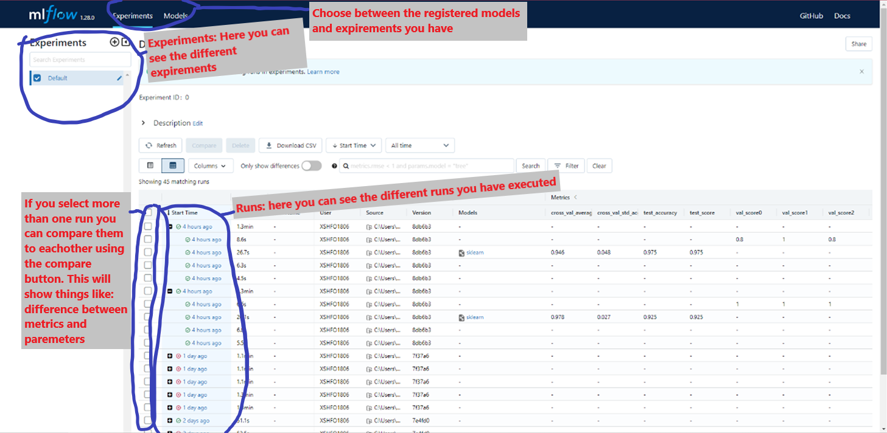

# HowTo MLFlow

This is a tutorial on how to make a quick MLFlow pipeline and get it up and running, as well as helping you understand how a basic MLFlow pipeline works.

We are gonna go through the theoreticals regarding the pipeline, how to create the steps, creating a `conda_env` file and finally an `MLproject` file. To end with, we are gonna be looking at how to run what you just created, as well as seeing the results of the pipeline afterwards.

## Table of contents

- [HowTo MLFlow](#howto-mlflow)
  - [Table of contents](#table-of-contents)
  - [Setup](#setup)
  - [What does a MLFlow pipeline consist of?](#what-does-a-mlflow-pipeline-consist-of)
  - [Creating the pipeline](#creating-the-pipeline)
    - [Making a conda\_env](#making-a-conda_env)
    - [MLproject file](#mlproject-file)
    - [Creating the steps](#creating-the-steps)
      - [Content for data\_ingestion step](#content-for-data_ingestion-step)
      - [Content for data\_display step](#content-for-data_display-step)
  - [Running the pipeline](#running-the-pipeline)
    - [Running the UI](#running-the-ui)

## Setup

Assuming you have installed `conda` (see link on how to [install](https://www.datacamp.com/tutorial/installing-anaconda-windows))
create and activate an environment with mlflow installed:

```bash
conda env create -n <name> pyton=3.9 mlflow=1.30.0
conda activate <name>
```

This will allow you to run the pipeline using mlflow's own run commands

## What does a MLFlow pipeline consist of?

A mlflow pipeline consists of the following elements:

- **steps**, hereunder is main step and the steps including the code for what you want to do in the pipeline
- **conda environment** file/or already made environment
- and in most cases an **MLproject file**.

> **NOTE:**
> if you are usign a conda environment that is already installed and you therefore don't have a conda environment file, you will need to specifically tell mlflow to use the local environment. For more information check: [Environment section](https://www.mlflow.org/docs/latest/projects.html#running-projects)

The **steps** are what is actually run in the pipeline. There is often a step called main.py that orchestrates how the steps run

The **MLproject file**, this file is kind of like the description of the pipeline and it helps MLFlow understand how your pipeline is run and how to show the runs in the UI. The file isn't mandatory, you will lose control over some things like which conda environment to use etc. if you chose to omit it.

**Lastly**, everything above will be placed in a folder. It's important that it looks like this:

```files
rootfolder
 - pipeline-folder
    - conda_env.yml
    - MLproject
    - steps
```

The reasoning is that the pipeline needs to be run from a folder a level above where the pipeline exists.

## Creating the pipeline

### Making a conda_env

Create a `conda_env.yml` file and add the following libraries:

- python
- pandas
- mlflow

It would look like this:

```yml
name: <environment-name>

dependencies:
- python=3.9.12
- pandas=1.4.2
- mlflow=1.30.0
```

The name of the file in the case of this tutorial will be: `conda_env.yml`

For more detailed information regarding how to make a `conda_env`, checkout this [website](https://conda.io/projects/conda/en/latest/user-guide/tasks/manage-environments.html#create-env-file-manually)

### MLproject file

The `MLproject` file is a file used for getting more control over how the pipeline is setup.
It consists of a name, conda environment and entrypoints (essentially the steps).
In our case we only have 3 steps in total, `main`, `data_ingestion` and `data_display`

Making the `MLproject` file isn't straightforward but when you get how it works, it shouldn't be a problem. Make a file and call it `MLproject` exactly, nothing else.

Now writing the file according to our tutorial would make it look like this:

```yml
name: HowToMLFlow

conda_env: conda_env.yml

entry_points:
  main:
     command: "python main.py"
  
  data_ingestion:
     command: "python data_ingestion.py"

  data_display:
     parameters:
        data_ingest_run_id: {type: str}
     command: "python data_display.py --data_ingest_run_id {data_ingest_run_id}
```

The parameter field is used to specify things that get send through when running the step. You can then pickup what was send through using the `argparse` or `click` library.

The parameters we use is there to send the `data_ingestion`step's run id on to `data_display` so we can grab the artifact we logged in that step.

### Creating the steps

Steps are simply Python scripts.
You can have as many steps as you want, but one must always be present: `main.py`.
In this tutorial we will create 3 steps (i.e., files): `main.py`, `data_ingestion.py`, `data_display.py`

Now that you have created these 3 steps, it's time to make the `main.py` useful by making it the orchestrator/controller of the 2 other steps execution.

Using the `mlflow.run()` will make a specific run with the help of MLFlow and the `MLproject` file, and then the files themselves start the run they are assigned using `mlflow.start_run()`

```python
import mlflow

data_ingestion_run = mlflow.run(
            "",
            "data_ingestion.py",
            parameters={},
            env_manager="local",
        )

data_display_run = mlflow.run(
            "",
            "data_display.py",
            parameters={"data_ingest_run_id": data_ingestion_run.run_id},
            env_manager="local",
        )
```

The parameter is explained in the [MLproject section](#mlproject-file)

#### Content for data_ingestion step

```python
import pandas as pd
import mlflow

def task():
    with mlflow.start_run() as mlrun:
        url= https://archive.ics.uci.edu/ml/machine-learning-databases/iris/iris.data

        df = pd.read_csv(url)
        df.to_csv("path_to_save_to")
```

Above is the code used for ingesting the data we want and then saving it.

Now for logging it to the mlflow run itself, using the path to the file you saved from the code above, we log it using this:

```python
mlflow.log_artifact("path_to_csv_file")
```

Now the artifact will be saved in the `data_ingestion` mlflow run, to be able to use it in the next run you'll have to access the `data_ingestion` run_id.

The way to extract artifacts is actually pretty easy. An artifact is simply a uri to the location of the file, so to extract an artifact you just have to use an appropriate library to read/get the file. *E.g* pandas `read_csv()` for .csv files

#### Content for data_display step

```python
import pandas as pd
import click
import mlflow

@click.command()
@click.option("--data_ingest_run_id")
def task(data_ingest_run_id)
    with mlflow.start_run() as mlrun:
        data_ingest_run = mlflow.tracking.MlflowClient().get_run(data_ingest_run_id)   
        dataset_path = Path(data_ingest_run.info.artifact_uri, "name_of_dataset_file")

        df = pd.read_csv(filepath_or_buffer=dataset_path)

        print(df.head(10))
```

With this your pipeline should be ready to run.

## Running the pipeline

Now, onto running the project itself. The prefix command for running a project is: mlflow run

> **NOTE:**
> When talking about a command it is generally understood that you are using a console/terminal that already is using a environment with mlflow

So an example command could look like this:

```yml
mlflow run mlflow-pipeline
```

Here is an empty command template:

```yml
mlflow run [project uri] [entry point] [parameters] [deployment mode] [environment]
```

To read more about the parameters see [here](https://www.mlflow.org/docs/latest/projects.html#running-projects)

As you can see, a lot of the different parameters (in the command itself) can be omitted since they might not always be needed. This is where it can differ a whole lot from other projects as well

### Running the UI

The UI is extremely easy to run since it’s a single command to start the UI. Afterwards it’s more about understanding how to navigate the UI and I’ll give a quick overview after giving the command.
The command for running the UI is:

```yml
mlflow ui
```

Here is a picture explaning some of the UI


There are some more information regarding the UI [here](https://www.mlflow.org/docs/latest/tracking.html#tracking-ui)
