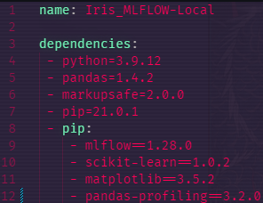

# HowTo MLFlow

This is a tutorial on how to make a quick pipeline and get it up and running.

What we are gonna do in this tutorial is to download a dataset and then log it as an artifact.

Afterwards we are gonna read it from another step and then print the first 10 lines.

## Table of contents

- [HowTo MLFlow](#howto-mlflow)
  - [Table of contents](#table-of-contents)
  - [SETUP](#setup)
  - [CREATING THE PIPELINE](#creating-the-pipeline)
    - [What does a pipeline consist of?](#what-does-a-pipeline-consist-of)
    - [Creating the steps](#creating-the-steps)
    - [Content for data_ingestion step](#content-for-data_ingestion-step)
    - [Making a conda_env](#making-a-conda_env)
    - [MLproject FILE](#mlproject-file)
    - [Content for data_display step](#content-for-data_display-step)
  - [RUNNING THE PIPELINE](#running-the-pipeline)
    - [RUNNING THE UI](#running-the-ui)

## SETUP

To get started you will need 2 things.

Nr. 1**Anaconda installed** (used to install python and libraries), you can find the guide on how to install: [here](https://www.datacamp.com/tutorial/installing-anaconda-windows)

Nr. 2 **MLFlow installed.** The easiest way to install MLFlow is searching for: Anaconda Prompt (Anaconda3) , then clicking enter and making sure the Anaconda Prompt is open, after that you can simply use this pip command to install MLFlow into your Anaconda Environment:

`pip install mlflow`

## CREATING THE PIPELINE

### What does a pipeline consist of?

A pipeline consists of the **steps**, a **conda environment** file/or already made environment and in most cases an **MLproject file**.

The **steps** are what is actually run in the pipeline

The **conda environment** is what determines what packages the pipeline should use. You can use a conda environment file, or your own local one. To learn more about environment files click [here](https://blog.devgenius.io/using-conda-environments-for-python-all-you-need-to-know-2eb36e224d1c)

The **MLproject file**, this file is kind of like the description of the pipeline and it helps MLFlow understand how your pipeline is run and how to show the runs in the UI

### Creating the steps

To create the steps you of course need to create the python files for the pipeline to use. In this case let's create 3 steps, called each: main.py, data_ingestion.py, data_display.py.

Now that you have created these 3 steps, it's time to make the main.py useful by making it the orchestrator/controller of the 2 other steps execution.

Using the mlflow.run() will make a specific run with the help of MLFlow and the MLproject, and then the files themselves start the run they are assigned using mlflow.start_run()

```python
data_ingestion_run = mlflow.run(
            "",
            "data_ingestion.py",
            parameters={},
            env_manager="local",
        )

data_display_run = mlflow.run(
            "",
            "data_display.py",
            parameters={"data_ingest_run_id": data_ingestion_run.run_id},
            env_manager="local",
        )
```

The parameter is explained in the [MLproject section](#mlproject-file)

### Content for data_ingestion step

Now onto what we want to include in the steps.

For the data ingestion, we want to get the dataset from a url and save it as an artifact.
To do that we will need to use these libraries:

- Pandas
- MLFlow

As soon as you have imported the above mentioned libraries, we can then write the code for downloading the dataset.

The url is something you can change to whatever dataset you might want.

```python
def task():
    with mlflow.start_run() as mlrun:
        url= https://archive.ics.uci.edu/ml/machine-learning-databases/iris/iris.data

        df = pd.read_csv(url)
        df.to_csv("path_to_save_to")
```

The code above will download and read the dataset from the url and make it into a pandas DataFrame. The dataframe can then be saved to a specific place of your choosing.

Now for saving/logging it to the mlflow run itself, we want to save it in a place we know the path to.

```python
mlflow.log_artifact("path_to_csv_file")
```

Now the artifact will be saved in the data_ingestion mlflow run, to be able to use it in the next run you'll have to access the data_ingestion run_id.

To do this you will need to know how to work the MLproject file, but first we also have to make sure you have a **conda environment** file setup so you can run the project when it's done.

### Making a conda_env

To make a **conda environment** file you will need to understand how it's layout looks.

Here is an example. A more detailed tutorial for conda_env can be found [here](https://blog.devgenius.io/using-conda-environments-for-python-all-you-need-to-know-2eb36e224d1c)



As you can see, you have to specify the name and what dependencies to use, dependencies are essentially just package/library names.

The dependencies needed for this project are:

- MLFlow
- Pandas
- Python

It would look like this:

```yml
name: HowToMLFlow

dependencies:
- python=3.9.12
- pandas=1.4.2
- pip=21.0.1
- pip:
    - mlflow==1.28.0
```

The name of the file in the case of this tutorial will be: `conda_env.yml`

Now that we have everything other than the MLproject file, it's time to make that file.

### MLproject FILE

The **MLproject** file is a file used for getting more control over how the pipeline is setup.
It consists of a name, conda environment and entrypoints (essentially the steps).
In our case we only have 3 steps in total, **main**, **data_ingestion** and **data_display**

Following what it consists of, lets make the **MLproject** file. Make a file and call it **MLproject** exactly, nothing else.

Now writing the MLproject according to our tutorial would make it look like this:

```yml
name: HowToMLFlow

conda_env: conda_env.yml

entry_points:
  main:
     command: "python main.py"
  
  data_ingestion:
     command: "python data_ingestion.py"

  data_display:
     parameters:
        data_ingest_run_id: {type: str}
     command: "python data_display.py --data_ingest_run_id {data_ingest_run_id}
```

The parameters is there to send the **data_ingestion** step's run id on to **data_display** so we can grab the artifact we logged in that step.

Now that you've written the MLproject file, let's move on to the data_display step

### Content for data_display step

We'll quickly go over the code for the data_display step as the only hardish part is getting the artifact

Here is the code, explanation will come afterwards

This code also assumes that you know basic file setup

Import the following libraries: pandas as pd, click and mlflow

And then we need to gather the data_ingest_run_id and use that to fetch the .csv file, then we read it using pandas and print it

```python
@click.command()
@click.option("--data_ingest_run_id")
def task(data_ingest_run_id)
    with mlflow.start_run() as mlrun:
        data_ingest_run = mlflow.tracking.MlflowClient().get_run(data_ingest_run_id)   
        dataset_path = Path(data_ingest_run.info.artifact_uri, "name_of_dataset_file")

        df = pd.read_csv(filepath_or_buffer=dataset_path)

        print(df.head(10))
```

With this your pipeline should be ready to run. 

## RUNNING THE PIPELINE

Now, onto running the project itself. The prefix command for running a project is: mlflow run

**_NOTE:_** When talking about a command it is generally understood that you are using a console/terminal that already is using a environment with mlflow

So an example command could look like this:

```yml
mlflow run iris-pipeline
```

Here is an empty command template:

```yml
mlflow run [project uri] [entry point] [paremeters] [deployment mode] [environment]
```

To read more about the parameters see [here](https://www.mlflow.org/docs/latest/projects.html#running-projects)

As you can see, a lot of the different parameters (in the command itself) can be omitted since they might not always be needed. This is where it can differ a whole lot from other projects as well


### RUNNING THE UI

The UI is extremely easy to run since it’s a single command to start the UI. Afterwards it’s more about understanding how to navigate the UI and I’ll give a quick overview after giving the command.
The command for running the UI is:

```yml
mlflow ui
```

Here is a picture explaning some of the UI


There are some more information regarding the UI [here](https://www.mlflow.org/docs/latest/tracking.html#tracking-ui)